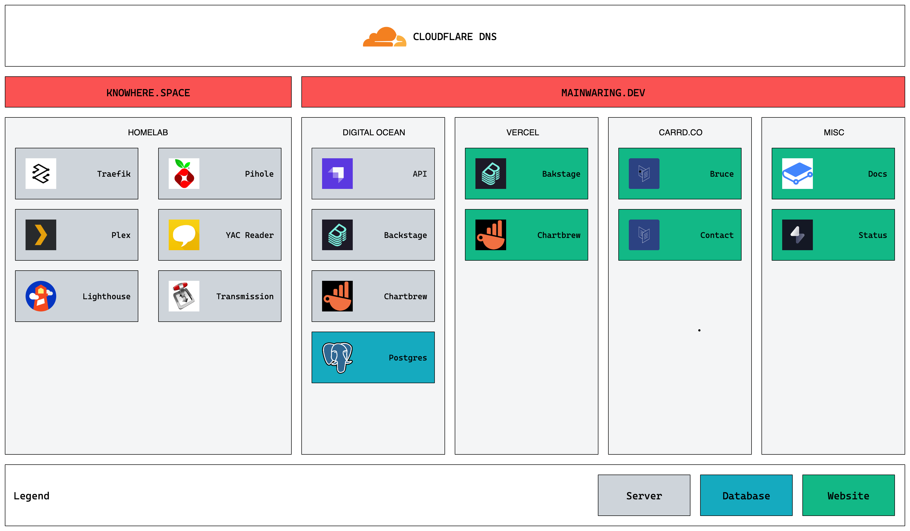

# Architecture

- Tenants
  - Low Code:  Solutions that require the least amount of hand-written code
  - Continous: Automated workflows as code is pushed to Github
  - GTM:  The sandbox should strive to deliver a full set of features that would be expected for a go-to-market saas product
  - Repeatable. The parts of the sandbox should be reusable in for-profit contexts as a quick option to solve problems.
- Data
  - Personal Data
    - Pulled from other services (blog posts, vinyl records)
    - Exported from other services (twitter, healthkit)
    - Manual data entry (press articles)
- Domain Design
  - `api.mainwaring.dev` => Strapi API server
  - `charts.mainwaring.dev` => Chartbrew Client
  - chart server => Chartbrew Server
  - `pwa.mainwaring.dev` => Ionic PWA (front-end sandbox)
  - `contacts.mainwaring.dev` => Marketing site (contact info)
  - `bruce.mainwaring.dev` => Marketing site (social experiment)
  - `mainwaring.dev` => Root Marketing Page
  - `docs.mainwaring.dev` => Product & Technical Documentation Portal
  - `status.mainwaring.dev` => Public uptime monitoring
- Hosting
  - Digital Ocean as the primary service for paid resources
    - Managed Postgres DB
    - Basic App
  - Heroku for backend services that can operate at the free-tier 
  - Vercel for front-end services that can operate at the free-tier
